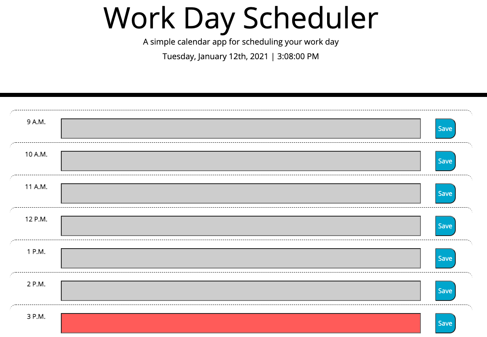

# Day-Planner

This a personal day planner that allows users to schedule their work day. When a user opens the browser they will see the current day and time, along with color coded time blocks. The grey represents the past, the red represents the current hour, and the green represents the future. The user can add text to each time block and save it to their local storage.

<strong>Deployed Link:</strong> https://amay1421.github.io/Day-Planner/
 
<strong>Repo Link:</strong>https://github.com/amay1421/Day-Planner

